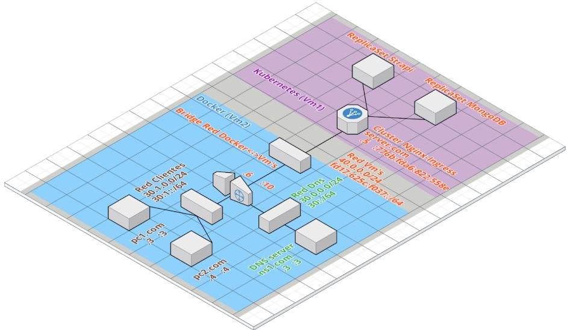

# Fcefyn :  Redes de computadoras 2020
### Grupo 13
#### Jose Cancinos - Oliva Nahuel

[Sistemas distribuidos : Kubernetes](https://drive.google.com/file/d/1DVJmtJdL60JY1OJpSpl5l6xpVlX1-rv2/view?usp=sharing)

[Ruteo Dinámico](https://drive.google.com/file/d/1TtFX4EZq7v9VoGlEH1gK50vEGf5gFcP0/view?usp=sharing)

[Análisis ipv6](https://drive.google.com/file/d/1FRprcBNHga8naYOsilHNT2bt-zuSuLI7/view?usp=sharing)

[Layer 4](https://drive.google.com/file/d/1TstGS4O5duYOg8Y6P9wRF77L9rhcccHo/view?usp=sharing)

[Layer 5](https://drive.google.com/file/d/1Z1qJmW6XIYj0UkJrYPFhVgQxKIx5FVol/view?usp=sharing)

[Kubernetes](https://drive.google.com/file/d/1OLsU48V76fb57wIGOHq1uRkFp3LkAtIt/view)